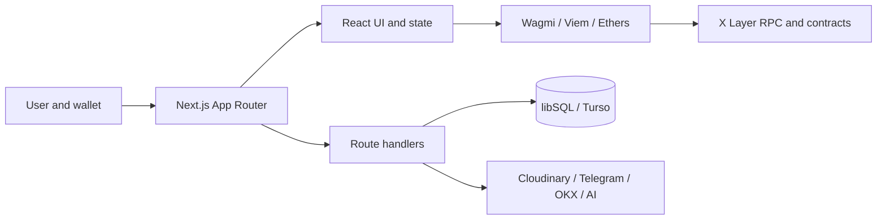

<div align="center">

# Banmao Fun

**Community, DeFi, GameFi, and on-chain experiences for X Layer.**

[](https://github.com/haivcon/banmao.fun/actions/workflows/ci.yml)
[](https://www.banmao.fun/)
[](https://www.okx.com/xlayer)
[](LICENSE)

[Live app](https://www.banmao.fun/) · [Issues](https://github.com/haivcon/banmao.fun/issues) · [Security](SECURITY.md)

</div>

Banmao Fun is a Next.js application that brings together community tools, token utilities, DeFi workflows, on-chain games, NFTs, and an opt-in AI assistant around the BANMAO ecosystem. The primary production network is **X Layer mainnet** (`chainId: 196`, native token: `OKB`).

> [!IMPORTANT]
> An address, ABI, route, source file, or feature flag in this repository does not by itself prove that a feature is deployed, enabled, audited, source-verified, or safe to use. Before signing, verify the selected chain, current address source, deployed bytecode, contract state, and transaction simulation. The statuses below describe repository evidence—not an audit or endorsement.

## Table of contents

- [Highlights](#highlights)
- [Application surfaces](#application-surfaces)
- [Architecture](#architecture)
- [Smart contracts](#smart-contracts)
- [Getting started](#getting-started)
- [Environment configuration](#environment-configuration)
- [Commands and testing](#commands-and-testing)
- [Contract development](#contract-development)
- [Security](#security)
- [Recommended roadmap](#recommended-roadmap)
- [Contributing](#contributing)

## Highlights

| Area | Capabilities |
|---|---|
| Community | Profiles, posts, social interactions, collections, media workflows, quests, messaging integrations, and creator tipping UI |
| DeFi | BANMAO staking, burn analytics, wallet/holder scanning, batch airdrops, BanmaoBox, and a feature-gated launchpad |
| GameFi | FOMO, Snake, Slots, Rock-Paper-Scissors, and PK experiences with wallet-connected on-chain flows |
| BanmaoBox | ERC-20 gift-box NFTs, multi-asset baskets, timelocks, batches, transferable ownership, and on-chain metadata |
| BANMAO AI | Feature-gated streaming chat, retrieval, read-only tools, and transaction draft simulation; it never signs or submits transactions |
| Experience | Responsive 2D/3D interfaces, PWA support, internationalization, animation, audio, injected wallets, and WalletConnect |

Availability depends on the active deployment, network, server configuration, external services, and feature flags. Optional integrations fail closed when required configuration is absent.

## Application surfaces

| Route | Purpose |
|---|---|
| `/` | Main 2D/3D landing and ecosystem navigation |
| `/collection` | Community profiles, posts, media, social features, and collection tools |
| `/defi` | DeFi directory and shared wallet/chain experience |
| `/defi/staking` | Multi-position BANMAO staking, rewards, compound, relock, and leaderboards |
| `/defi/airdrop` | Wallet scanning, CSV/address workflows, direct transfers, and contract-assisted batch airdrops |
| `/defi/burn` | BANMAO burn statistics, history, and contributor views |
| `/defi/box` | Create, inspect, transfer, and redeem BanmaoBox NFTs |
| `/defi/launchpad` | Bonding-curve launch UI; disabled until a valid deployment is configured |
| `/gamefi` | Game directory |
| `/gamefi/banmaofomo` | Timer-based FOMO game |
| `/gamefi/banmaosnake` | Snake with EIP-712 reward claims |
| `/gamefi/banmaoslots` | Multi-pool commit/reveal slots and house tools |
| `/gamefi/banmaorps` | Commit/reveal Rock-Paper-Scissors |
| `/gamefi/banmaopk` | Experimental/testnet challenge and voting experience |

Administrative routes also exist for maintainers. Their presence is not proof of authorization, production readiness, or public availability.

## Architecture

| Layer | Technology / responsibility |
|---|---|
| Web | Next.js 16 App Router, React 19, TypeScript 5, Tailwind CSS 4 |
| Wallet and chain | Wagmi, Viem, Ethers; X Layer mainnet `196` and opt-in BanmaoBox testnet `1952` |
| State | TanStack Query and Zustand |
| Media and 3D | Cloudinary, Three.js, React Three Fiber, Drei, Framer Motion |
| Server | Next.js Route Handlers, same-origin integrations, libSQL/Turso readers |
| Contracts | Solidity, OpenZeppelin, generated or module-local TypeScript ABIs |
| Quality | TypeScript, ESLint, Jest, GitHub Actions, dependency audit, gitleaks |
| Hosting | Vercel; deployment status is independent from GitHub CI |



```text
.github/       CI, ownership, dependency policy, and contribution templates
__tests__/     Application, integration, AI, and BanmaoBox security suites
app/           App Router pages, APIs, UI, DeFi, GameFi, and adapters
components/    Shared React components
contracts/     Solidity source and contract-specific documentation
deployments/   BanmaoBox manifests and immutable release evidence
docs/ai/       BANMAO AI architecture, privacy, operations, and rollout
lib/           Shared client/server libraries
scripts/       BanmaoBox generation, deployment, verification, and maintenance tools
```

## Smart contracts

### Status vocabulary

- **Manifest-backed**: a versioned manifest records addresses, transactions, compiler metadata, and runtime fingerprints.
- **App-configured**: the frontend currently selects this address for the stated chain. This is weaker than a deployment manifest.
- **Environment-gated**: the default is the zero address; writes stay disabled until maintainers provide a valid deployment.
- **Testnet / experimental**: not a canonical X Layer mainnet deployment.
- **Source only**: Solidity exists, but no active canonical deployment is configured.

### X Layer mainnet configuration

These addresses are selected by the current application on X Layer mainnet. Explorer links are provided only for this app-configured or manifest-backed set. Always verify them independently before use.

| Module | Contract | Address | Repository evidence |
|---|---|---|---|
| Token | BANMAO ERC-20 | [`0x16d9…eF78`](https://web3.okx.com/explorer/x-layer/evm/address/0x16d91d1615fC55b76d5F92365BD60C069b46eF78) | Shared configuration; also recorded by the Box manifest |
| DeFi | BanmaoStaking | [`0xa553…A172`](https://web3.okx.com/explorer/x-layer/evm/address/0xa553f61F2a4fa61f6DDC8bf2b0B66F65c7eAA172) | [App-configured](app/defi/staking/contracts.ts) |
| DeFi | BanmaoAirdrop | [`0xf2d4…63a0`](https://web3.okx.com/explorer/x-layer/evm/address/0xf2d471711D24646b2C50E1F74a063caA7a6863a0) | [App-configured](app/defi/airdrop/components/airdropTypes.ts) |
| GameFi | BanMaoSnake | [`0x986d…3BaF`](https://web3.okx.com/explorer/x-layer/evm/address/0x986dE458302005890d708B3930ce57cD1E1E3BaF) | [App-configured](app/gamefi/banmaosnake/lib/constants.ts) |
| GameFi | BanMaoFomo V11 | [`0xf771…3E21`](https://web3.okx.com/explorer/x-layer/evm/address/0xf77195f556Aee264Cc0Edc387d758018ad7b3E21) | [App-configured](app/gamefi/banmaofomo/lib/constants.ts) |
| GameFi | BanmaoRPS | [`0x2Ae4…5aCB`](https://web3.okx.com/explorer/x-layer/evm/address/0x2Ae44e728106a826616aA8CFec062F22bE255aCB) | [App-configured](app/gamefi/banmaorps/lib/constants.ts) |
| GameFi | Banmao Slots | [`0x9c64…a2d2`](https://web3.okx.com/explorer/x-layer/evm/address/0x9c64c18D792Eab435d1d921efaC978F6A62da2d2) | [App-configured](app/gamefi/banmaoslots/lib/abis.ts); implementation version needs verification |
| BanmaoBox | Factory | [`0x01E0…d9E9`](https://web3.okx.com/explorer/x-layer/evm/address/0x01E03F6eb085f4934A3A7946545b00341B95d9E9) | [Manifest-backed](deployments/banmaobox-xlayer-mainnet.json) |
| BanmaoBox | Current Renderer | [`0x4793…21F`](https://web3.okx.com/explorer/x-layer/evm/address/0x479365c028A1FA633b16BBef95e8691D4f37B21F) | [Manifest-backed](deployments/banmaobox-xlayer-mainnet.json) |
| BanmaoBox | Canonical BANMAO Box | [`0xE824…999f`](https://web3.okx.com/explorer/x-layer/evm/address/0xE8247C96787119A8F7E8F8C81F58BeC5BEFC999f) | [Manifest-backed](deployments/banmaobox-xlayer-mainnet.json) |
| BanmaoBox | Factory-era Renderer | [`0xE19c…0769`](https://web3.okx.com/explorer/x-layer/evm/address/0xE19c875dBfa80171819E443e46Fc7839a9290769) | Immutable constructor provenance in the manifest |

A read-only RPC inspection performed while preparing this document found runtime bytecode at the app-configured mainnet addresses above. That observation is time-sensitive and does **not** establish that runtime bytecode matches this repository's source, except where a checked-in manifest and release workflow provide stronger evidence.

### Not currently canonical mainnet deployments

| Module | Current repository state | Status |
|---|---|---|
| BanmaoHub | Frontend constant is the zero address | Unconfigured |
| Launchpad | `NEXT_PUBLIC_LAUNCHPAD_ADDRESS` defaults to zero and the UI disables writes | Environment-gated / source only |
| BanMaoFomo V3 | Legacy frontend slot is the zero address; V11 is active | Legacy placeholder |
| BanMaoPK | UI and source describe a testnet/experimental game; no bytecode was found at its candidate address on mainnet | Testnet / experimental |
| MockBanmao | Development helper used by the BanmaoBox source tree | Test helper only |
| BanmaoBox testnet | Versioned chain `1952` manifest; UI requires an explicit opt-in flag | Testnet manifest |

### Solidity source catalog

The repository contains **18 Solidity source files**. Source availability must not be confused with deployment or audit status.

| Area | Source | Purpose | Deployment classification |
|---|---|---|---|
| DeFi | [`BanmaoAirdrop.sol`](contracts/BanmaoAirdrop/BanmaoAirdrop.sol) | Owner-funded batch ERC-20 distribution | App-configured |
| Community | [`BanmaoHub.sol`](contracts/BanmaoHub/BanmaoHub.sol) | Profiles, posts, interactions, follows, tips, and moderation primitives | Unconfigured |
| DeFi | [`BanmaoStaking.sol`](contracts/BanmaoStaking/BanmaoStaking.sol) | Multi-position staking and reward flows | App-configured |
| Box | [`BanmaoBox.sol`](contracts/BanmaoBox/Box/BanmaoBox.sol) | ERC-721 token and multi-token gift boxes | Manifest-backed |
| Box | [`BanmaoBoxFactory.sol`](contracts/BanmaoBox/Factory/BanmaoBoxFactory.sol) | Canonical per-token Box registry and deployment | Manifest-backed |
| Box | [`BanmaoBoxRenderer.sol`](contracts/BanmaoBox/Renderer/BanmaoBoxRenderer.sol) | Fully on-chain NFT metadata and SVG rendering | Manifest-backed |
| Box | [`MockBanmao.sol`](contracts/BanmaoBox/Mock/MockBanmao.sol) | Local/test ERC-20 helper | Test helper only |
| GameFi | [`BanMaoFomo.sol`](contracts/BanMaoFomo/BanMaoFomo.sol) | Timer-based FOMO rounds and rewards | App-configured as V11; verify source/runtime |
| GameFi | [`BanMaoPK.sol`](contracts/BanMaoPK/BanMaoPK.sol) | Challenge, voting, and reward mechanics | Testnet / experimental |
| GameFi | [`BanmaoRPS.sol`](contracts/BanmaoRPS/BanmaoRPS.sol) | Commit/reveal Rock-Paper-Scissors | App-configured |
| GameFi | [`BanmaoSlotsMultiPool.sol`](contracts/BanmaoSlotsMultiPool/BanmaoSlotsMultiPool.sol) | Multi-pool commit/reveal Slots V1 | Active-address version unconfirmed |
| GameFi | [`BanmaoSlotsMultiPoolV2.sol`](contracts/BanmaoSlotsMultiPoolV2/BanmaoSlotsMultiPoolV2.sol) | Extended multi-pool Slots V2 | Active-address version unconfirmed |
| GameFi | [`BanMaoSnake.sol`](contracts/BanMaoSnake/BanMaoSnake.sol) | EIP-712 game reward claims and rate caps | App-configured |
| Launchpad | [`BanmaoLaunchpad.sol`](contracts/Launchpad/Core/BanmaoLaunchpad.sol) | Token creation, bonding curve, trading, and graduation | Source only |
| Launchpad | [`ILaunchpadHook.sol`](contracts/Launchpad/Hook/ILaunchpadHook.sol) | Hook interface shared by launch contracts | Source only |
| Launchpad | [`LaunchpadHook.sol`](contracts/Launchpad/Hook/LaunchpadHook.sol) | Uniswap v4 lifecycle and fee hook | Source only |
| Launchpad | [`LiquidityLocker.sol`](contracts/Launchpad/Locker/LiquidityLocker.sol) | Graduated-position liquidity locking | Source only |
| Launchpad | [`MemeToken.sol`](contracts/Launchpad/Token/MemeToken.sol) | Cloneable launch token implementation | Source only |

### BanmaoBox release evidence

The canonical mainnet source of truth is [`deployments/banmaobox-xlayer-mainnet.json`](deployments/banmaobox-xlayer-mainnet.json); the opt-in testnet record is [`deployments/banmaobox-xlayer-testnet.json`](deployments/banmaobox-xlayer-testnet.json). The mainnet manifest distinguishes immutable Factory-era renderer provenance from the renderer currently used by the canonical collection.

The current Renderer runtime is recorded as 19,214 bytes with keccak256 `0xd69507283765b914480cf8aa8a8f37f4bbd351b0620ede3b0bbd5e3ca390f703`. Its immutable compiler-input release is [`22aad5…ebc8d.json`](deployments/banmaobox-releases/22aad5bfec33af537e970ff3f2cca2f43d7ebfe63d1c537712d9ecb8728ebc8d.json).

BanmaoBox is non-custodial: users sign in their own wallets, and redemption does not depend on a backend custodian. A valid timelock has no maintainer bypass or early-unlock path. Third-party token behavior—including fees, pausing, blacklisting, rebasing, or upgrades—can still affect transfers. Detailed invariants and the deployment runbook live in [`contracts/README.md`](contracts/README.md). Launchpad-specific Foundry and deployment-order guidance lives in [`contracts/Launchpad/README.md`](contracts/Launchpad/README.md).

## Getting started

- Node.js version from [`.nvmrc`](.nvmrc) (currently Node 22)
- npm and the checked-in `package-lock.json`
- A browser wallet for wallet-connected features
- Optional service credentials only for the integrations you enable

```bash
git clone https://github.com/haivcon/banmao.fun.git
cd banmao.fun
npm ci
cp .env.example .env.local
npm run dev
```

Open [http://localhost:3000](http://localhost:3000). All optional AI flags default to disabled. The Telegram companion integration is disabled with HTTP 503 unless its server-only API origin is configured.

## Environment configuration

[`.env.example`](.env.example) contains variable names, safe placeholders, purpose comments, and disabled defaults. Never copy a real environment file into the repository.

| Category | Examples | Exposure |
|---|---|---|
| Public chain/wallet settings | `NEXT_PUBLIC_XLAYER_*`, `NEXT_PUBLIC_WC_PROJECT_ID` | Browser-visible by design; never credentials |
| Feature-gated deployments | `NEXT_PUBLIC_LAUNCHPAD_ADDRESS`, `NEXT_PUBLIC_LAUNCHPAD_DEPLOYMENT_BLOCK`, `NEXT_PUBLIC_BANMAOBOX_TESTNET_UI` | Browser-visible; zero/false defaults keep features disabled |
| Server service integrations | `CLOUDINARY_URL`, `TELEGRAM_API_BASE_URL` | Server only |
| Shared persistence | `TURSO_DATABASE_URL`, `TURSO_AUTH_TOKEN` | Server only |
| BANMAO AI | `AI_API_KEY`, feature flags, session/SIWE and budget settings | Server only |
| Chain readers | `XLAYER_RPC_URL` | Server only |
| Explorer verification | `OKX_API_KEY`, `OKX_SECRET_KEY`, `OKX_PASSPHRASE`, `OKX_PROJECT_ID` | Server only |

No credential, private key, passphrase, or session secret may use a `NEXT_PUBLIC_` prefix. Use HTTPS service origins in shared environments. Deployment keys belong only in ignored maintainer-local configuration and are never required for development or CI.

## Commands and testing

| Command | Purpose |
|---|---|
| `npm run dev` | Start the development server |
| `npm run build` | Create a production build |
| `npm run start` | Serve a completed production build |
| `npm run typecheck` | Run TypeScript without emitting files |
| `npm run lint` | Run ESLint |
| `npm test -- --runInBand` | Run all Jest-discovered tests serially |
| `npm run test:contracts` | Run the BanmaoBox contract/security suite |
| `npm run test:release` | Validate immutable BanmaoBox verification-release behavior |
| `npm run check:generated` | Regenerate canonical BanmaoBox outputs and reject drift/missing immutable evidence |
| `npm run check` | Run generated checks, typecheck, lint, and all Jest tests |

Jest discovers `__tests__/**/*.test.ts` through one configuration; there are no Jest projects and no `--selectProjects` workflow. Contract tests live under `__tests__/contracts/`, AI tests under `__tests__/ai/`, and the remaining application/integration suites preserve their current paths.

## Contract development

### BanmaoBox generated artifacts

After an approved change to the physical sources under `contracts/BanmaoBox/`:

```bash
npm run generate:banmaobox
npm run generate:banmaobox:release
npm run check:generated
```

Commit these together when changed:

- `app/defi/box/generated/abis.ts`
- `deployments/banmaobox-release-artifacts.json`
- `lib/banmaobox/verification-release.json`
- the matching new hash-versioned file under `deployments/banmaobox-releases/`

Never overwrite or remove historical releases, deployment manifests, or deployment records. Generation is local and deterministic; deploy, publish, and Explorer verification commands are maintainer-only operations and are not run by CI.

BanmaoBox compilation preserves legacy virtual Standard JSON and Explorer names under `contracts/banmaobox/`; those names are provenance identifiers, not physical paths.

### Launchpad Foundry project

The Launchpad is an independent Foundry project. Install its pinned dependencies locally, then build and test from its directory:

```bash
cd contracts/Launchpad
forge install Uniswap/v4-core Uniswap/v4-periphery --no-commit
forge build
forge test
```

Its hook requires CREATE2 address mining for the expected Uniswap v4 permission bits. Run a fork test of the complete graduation and migration path before any live deployment. See [`contracts/Launchpad/README.md`](contracts/Launchpad/README.md).

The remaining Solidity modules currently have no shared repository-wide compile/deploy command or canonical deployment-manifest pipeline. Add module-specific unit, fuzz, invariant, and fork coverage before treating them as release-ready.

## Security

- Wallets retain signing authority; the application must not request seed phrases or private keys.
- Server credentials remain server-only and are redacted from errors and logs.
- BANMAO AI tools are allowlisted and read-only unless a user explicitly reviews a bounded transaction draft; the copilot never signs or submits it.
- Web3 writes require the intended chain and validated deployment/runtime relationships.
- Feature flags and external services fail closed when required configuration is absent.
- Production dependency auditing and full-history gitleaks scanning run independently from Vercel deployment status.

Report vulnerabilities only through a [private GitHub Security Advisory](https://github.com/haivcon/banmao.fun/security/advisories/new); see [SECURITY.md](SECURITY.md). Do not publish exploit details in an issue.

## Recommended roadmap

These are repository improvement recommendations, not promises of delivery:

1. **Unify the contract registry (P0).** Replace duplicated module constants with per-chain manifests consumed by the frontend, server readers, AI adapters, tests, and documentation.
2. **Attest every write target (P0).** Record deployment transaction/block, compiler input, source commit, runtime hash, verification status, and lifecycle state (`active`, `legacy`, `testnet`, or `disabled`). Fail closed on chain/address/runtime mismatch.
3. **Close deployment-evidence gaps (P0).** Add manifests for Staking, Airdrop, Snake, FOMO, RPS, and Slots; identify whether the active Slots runtime is V1 or V2; keep Hub and Launchpad disabled until canonical deployments exist.
4. **Expand contract assurance (P0).** Add Foundry unit, fuzz, invariant, fork, access-control, token-compatibility, commit/reveal timeout, and economic-invariant tests. Obtain independent review before describing any module as audited or production-ready.
5. **Improve release discipline (P1).** Add semantic releases, `CHANGELOG.md`, module release notes, deployment diffs, and an explicit mainnet/testnet/source-verified/audited support matrix.
6. **Improve documentation and CI (P1).** Add optimized product screenshots, split deep operations into `docs/`, run a Markdown link checker, and test that documented addresses and source paths match the canonical registry.

## Contributing

Read [CONTRIBUTING.md](CONTRIBUTING.md), follow the [Code of Conduct](CODE_OF_CONDUCT.md), and use the issue templates for bugs, features, or configuration questions. See [SUPPORT.md](SUPPORT.md) for safe support channels.

CI checks generated artifacts, TypeScript, ESLint, Jest, critical production dependency advisories, and Git history for secrets. Do not infer green CI from this document; use the status on the exact commit or pull request.

## Deployment policy

Vercel status is separate from GitHub CI. Pushes may be handled by the connected Vercel project, but contributors must not trigger deploy/publish scripts or edit production infrastructure as part of a normal change. Environment values are managed in the hosting platform, never committed. Contract deployment, Explorer submission, release replacement, and repository visibility changes require explicit maintainer approval and independent verification.

## Acknowledgments

Banmao Fun builds on Next.js, React, TypeScript, Tailwind CSS, Wagmi, Viem, Ethers, Three.js, OpenZeppelin, X Layer, and the broader open-source ecosystem.

## License

Copyright (c) 2026 Hai V Con. Licensed under the [MIT License](LICENSE).
